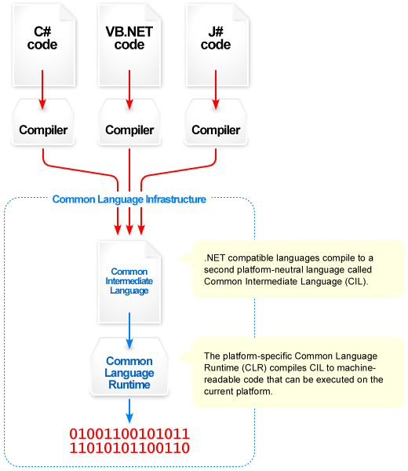

# Mémo C# .Net - HelloWorld
## *Campus Numérique 2018 - Véronique*
#
## Ressources en ligne

* [Cours sur le fonctionnement sur Open ClassRoom](https://openclassrooms.com/fr/courses/392266-developpement-c-net/391031-le-fonctionnement-de-net)
* [Cours HelloWorld sur Open ClassRoom](https://openclassrooms.com/fr/courses/218202-apprenez-a-programmer-en-c-sur-net/217501-les-winforms-ou-windows-forms)
* [Documentation Microsoft](https://docs.microsoft.com/fr-fr/visualstudio/ide/quickstart-visual-basic-console)

## Définition

`Langage compilé` : Après avoir écrit le code, il est nécessaire d'utiliser un compilateur qui transformera le programme en langage machine compris par le processeur.

Si une modification doit être apportée au programme, il faudra compiler à nouveau le code source.

Mais une fois compilé, le programme n'aura plus besoin de rien d'autres pour fonctionner.

`Langage interprété` : Il n'est pas tranformé en langage machine avant d'être exécuté. Un interpréteur transforme la source en un résultat. Les exemples les plus simples de langages interprétés sont les langages permettant d'afficher une page web, ils sont lus par une programme externe *(le navigateur web)* qui affichera un résultat.

Si une modification est ajoutée au code source, il n'y aura pas besoin de compiler une nouvelle fois l'application.

Mais ces types de programmes ont besoin d'autres programmes pour être exécutés.

# Fonctionnement de .net

Le C# est un langage à mi-chemin entre un **langage compilé** et **langage interprété** : il n'est pas directement compilé en langage machine, mais il n'est pas non plus interprété !

En réalité, ils est compilé en un langage intermédiaire *(appelé IL pour "Intermediate Language")*. Lors de l'exécution ce langage intermédiaire va être compilé en langage machine et exécuté par le CLR *(Common Language Runtime)*, ce "runtime" va en quelque sorte faire l'intermédiaire entre le code et le système d'exploitation en apportant une importante abstraction vis à vis de fonctions systèmes de bases *(entrés/sorties, gestion de la mémoire, etc...)*.

## Shéma du fonctionnement interne de .net

