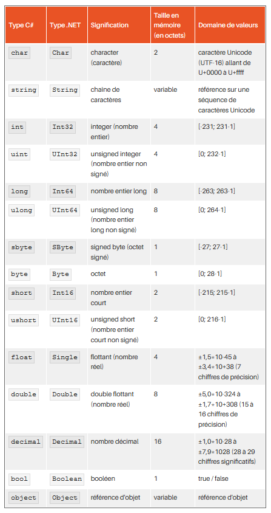

# Mémo C# .Net
## *Campus Numérique 2018 - Véronique*
#
## Ressources en ligne

* [Cours sur Open ClassRoom](https://openclassrooms.com/fr/courses/218202-apprenez-a-programmer-en-c-sur-net)
* [Documentation .NET](https://docs.microsoft.com/fr-fr/dotnet/standard/)
* [Documentation C#](https://docs.microsoft.com/fr-fr/dotnet/csharp/tour-of-csharp/)
* [Guide de programmation C#](https://docs.microsoft.com/fr-fr/dotnet/csharp/programming-guide/index)

## Glossaire

* [Glossaire sur le net](https://fr.wikibooks.org/wiki/Programmation_C_sharp/Glossaire)

| Terme        | Définition     |
| ------------- |-------------- | 
| C#     | Language de programmation orienté objet récent (début 2000) inspiré de Java (donc typé) et développé par Microsoft. C'est le langage recommandé pour développer sous Windows. |
| .Net   | C'est le framework ou environnement d'exécution (aussi écrit Dot NET et prononcé "dotte nette") pour programmer en C# sous Windows : accès réseau, création de fenêtres, appel à une base de données... Pour développer sous MacOS ou Linux il faut utiliser .NET Core |
|JSON | le forat JavaScript Object Notation est un format de données très populaire permettant de représenter de l’information structurée, comme le XML. L’avantage du JSON est qu’il fonctionne nativement avec le JavaScript et qu’il est beaucoup moins verbeux. En général, on se sert du JSON pour sérialiser ou désérialiser un objet afin de le faire transiter entre deux systèmes hétérogènes.|
|||
| Attribut    |   Un attribut est l'équivalent d'une variable déclarée dans une classe. Il possède donc un nom et un type. Il a également un niveau d'accès (public, protégé, privé) et peut également avoir une valeur par défaut.    |
| Classe       | Ensemble d'attributs et de méthodes (Moule de l'objet)    |
| Classe abstraite | Une classe qui est déclarée `astract` n'a pas besoin d'être instanciée pour être utilisée |
| Classe concrète | Classe qui peut être instanciée pour créer un objet |
| Constructeur | Méthode appelée lors de la construction d'un objet |
| Enfant | Classe qui hérite des attributs et méhodes de la classe parent |
| Énumération | Une énumération est un type qui est défini par la liste des valeurs possibles. |
| Exception | Une exception est un objet particulier signalant une erreur. Une exception est lancée au moment où l'erreur se produit. 
| Fonction | Une fonction possède un nom et une série de paramètre et retourne une valeur. Lorsqu'elle est membre d'une classe, elle est plutôt appelée méthode.
| Héritage (Extend)| Création d'une classe fille qui récupère les attributs de la classe mère. Une classe peut hériter des membres (méthodes, attributs, propriétés) d'une ou plusieurs classes de base. En C#, une classe ne peut hériter que d'une seule classe de base .
| Getteur | Permet de récupérer les attributs de la classe |
| Instance            |  *Instancier* une classe, c'est se servir d'une classe afin qu'elle crée un objet. Une instance est donc un objet |
| Internal | Les types et les membres internes (internal) sont accessibles uniquement dans les fichiers d’un même assembly. L’accès interne est fréquemment utilisé lors du développement basé sur les composants, car il permet à un groupe de composants de collaborer de façon privée sans être exposés au reste du code de l’application. 
| Interface | Une interface ne fait que décrire une liste de méthodes, sans implémentation. Le code de ces méthodes est fourni par les classes qui implémentent l'interface. Classe 100% abstraite pouvant être utilisée par plusieurs enfants.
| Implements | Mot clé pour qu'une classe utilise une interface |
| Méthodes            | Une méthode est une fonction de la classe |
| Objet               | Programme autosuffisant
| Package | C'est le dossier où les classes sont rangées / Charger un package permet d'utiliser les classes qu'il contient  |
| Polymorphisme | Comportement d'une méthode qui peut être différent selon les situations  |
| Parent | Classe principale |
| Propriété | Une propriété est un couple de méthode (get et set) permettant respectivement de lire et d'écrire une valeur particulière de la classe. 
| Sérialiser |  signifie que l’instance d’un objet subit une transformation afin de pouvoir être stockée au format texte, ou binaire. Inversement, la `désérialisation` permet de reconstruire une instance d’un objet à partir de ce texte ou de binaire.|
| Setteur | Permet de modifier les attributs de la classe |
| Surcharger | Redéfinir une méthode dans une classe fille |
| Variables | Obligatoirement écrit avec des caratères alphanumériques et _ (underscore) et doit forcément commencer par une lettre. Il ne doit pas être un mot réservé : Type ou classe déjà définie.|

## Variables


### Conventions d'écriture des variables

* les `guillemets ( " )` servent à encadrer une chaîne de **caractères**
* les `apostrophes ( ' )` servent à encadrer un **caractère**.
```csharp
"Une phrase" et 'A'.
```
* Pour utiliser une variable, il faut d'abord la déclarer : on réserve une partie de la mémoire pour cette variable. On spécifie ce qu'elle représentera *(un entier, un caractère, une image, ...)* en indiquant son type.
```
La syntaxe est : type nom;
```
* **NB** : le point-virgule est indispensable sans quoi Visual Studio ne peut pas compiler le code.
* **NB** : Il est nécessaire de donner une valeur par défaut aux variables crées. Sinon, le compilateur retournera une erreur.
```
string message = String.Empty; // Empty est une méthode de la classe System.String
string message = "";
```
* Il existe deux sortes de types : les ``types valeur`` *(notamment les structures)* et les ``types référence`` *(notamment les classes)*.


## Les énumérations

Liste de valeurs qui a un type unique. Ce type est le nom de l'énumération. 
```csharp
enum Temps
{
    Inconnu,
    Soleil,
    Nuageux,
    Pluvieux
}
```
On peut ainsi déclarer une variable de type Temps :
```
Temps tempsDuJour = Temps.Soleil;
```
La variable est initialisée à la valeur "Soleil"

* **NB** : Les énumérations se déclarent en tant que membre d'une classe et non dans une méthode.
## Les opérateurs et l'utilisation des conditions sont identiques à JAVA.

| Opérateur           | Définition        | 
| ------------------- |------------------ | 
| <     |   plus petit que          |
| <=    |   plus petit ou égal à    |
| >     |   plus grand que          |
| >=    |   plus grand ou égal à    |
| ==    |   égal à                  |
| !=    |   différent de            |
| &&    |   comparaison "et"        |
| `||`  |   comparaison "ou"        |
|       |                           |
## Quelques exemples de syntaxe

Affichage dans la console
```csharp
Console.WriteLine("…");
```
Utilisation dans la classe Program.cs 
```csharp
using System;
using System.Collections.Generic;
using System.Linq;
using System.Text;
using System.Threading.Tasks;

namespace HelloWorld
{
    class Program
    {
        static void Main(string[] args)
        {
            Console.WriteLine("Hello World !");
        }
    }
}
```
Pour initialiser une variable à 0
```csharp
string message = string.Empty;
// Identique à : (string message = "";)
```
## Tableaux 

```csharp
string[] jours = new string[] { "Lundi", "Mardi", "Mercredi", "Jeudi", "Vendredi", "Samedi", "Dimanche" };
Console.WriteLine(jours[3]); // affiche Jeudi
Console.WriteLine(jours[0]); // affiche Lundi
Console.WriteLine(jours[10]); // provoque une erreur d'exécution car l'indice n'existe pas
```

Trier rapidement un tableau : 
```csharp
Array.Sort(jours);
```

## Listes

```csharp
List<int> chiffres = new List<int>(); // création de la liste
chiffres.Add(8); // chiffres contient 8
chiffres.Add(9); // chiffres contient 8, 9
chiffres.Add(4); // chiffres contient 8, 9, 4

//Récupérer la position d'un élément dans une liste
int indice = jours.IndexOf(4); // indice vaut 2

//Supprimer un élément par sa position dans la liste
chiffres.RemoveAt(1); // chiffres contient 8, 4

//Parcourir une liste
foreach (int chiffre in chiffres)
{
    Console.WriteLine(chiffre);
}
```

## Dictionary 

Les Dictionary fonctionnent avec une "Key" `une clé unique` et une "Value" `une valeur`

### Déclarer et ajouter dans un Dictionary

```csharp
// Création du dictionnaire.
Dictionary<string, string> openWith = new Dictionary<string, string>();

// Ajout de quelques éléments. Il ne peut pas y avoir
// deux clefs identiques mais les valeurs peuvent l'être.
openWith.Add("txt", "notepad.exe");
openWith.Add("bmp", "paint.exe");
openWith.Add("dib", "paint.exe");
openWith.Add("rtf", "wordpad.exe");
```

### Afficher les données 

Les Dictionary possédent des propriétés utiles : 
* `monDictionnaire.Keys` : collection qui contient les clés du dictionnaire.
* `monDictionnaire.Values` : est une collection qui contient les valeurs du dictionnaire.

Afficher les clés d'un dictionnaire : 
```csharp
//Afficher les clés du Dictionary (liste sans doublons)
foreach (String key in listeSansDoublons.Keys)
{
    Console.WriteLine(key);
}
```
Parcourir un Dictionary 
```csharp
//Parcourir la lite sans doublons (type Dictionary) pour afficher la paire "key - value"
foreach (KeyValuePair<String, List<String>> kvp in listeSansDoublons)
{
    //Afficher ma clé 
    Console.WriteLine(kvp.Key);

    //Afficher les values (car ma valeur est une Liste)
    foreach (String val in kvp.Value)
    {
        Console.WriteLine(val);
    }
}
```

## Quelques raccourcis clavier
| Raccourcis | Utilisation |
| :------------- |-------------- | 
| F5 | Lancement du débogage dans la console 
| ctrl + k et ctrl + c | Ajouter un commentaire (on peut aussi juste ajouter // devant la ligne à commenter) 
| ctrl + k et ctrl + u | Retirer un commentaire
| ctrl + k et ctrl + d | Indenter 

