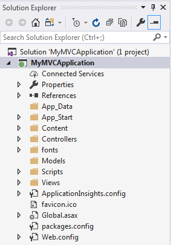
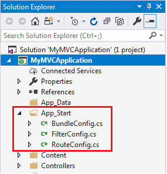
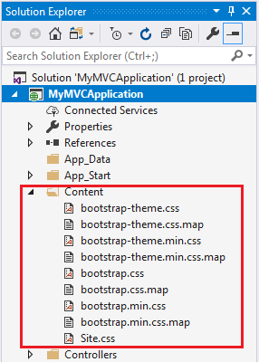
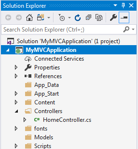
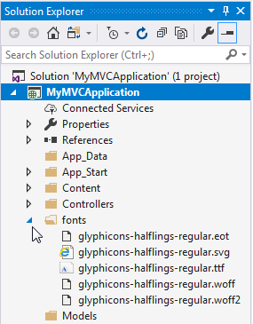
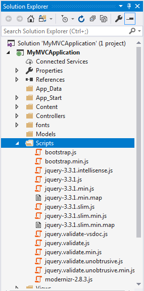
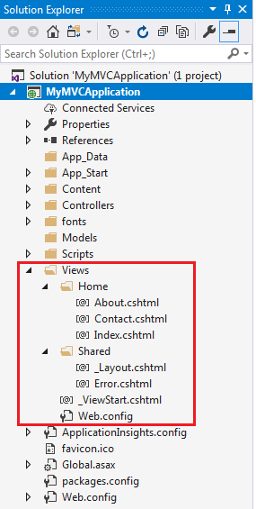

# Mémo C# MVC ASP.NET
## *Campus Numérique 2018 - Véronique*
#
## Ressources en ligne


[Tuto ASP.NET](http://www.tutorialsteacher.com/mvc/asp.net-mvc-tutorials)

## Rappel sur l'architecture MVC

1. MVC signifie Modèle, Vue et Contrôleur.
2. Le modèle (Model) est responsable de la maintenance des données de l'application et de la logique métier.
3. La vue (View) est une interface utilisateur de l'application qui affiche les données.
4. Le contrôleur (Controller) traite les demandes de l'utilisateur et restitue l'affichage approprié avec les données de modèle.

## Créer une première application

1. File menu -> New -> Project
2. Web -> ASP.NET Web Application (.NET Framework) -> Donner un nom -> OK
3. MVC -> Décocher ou non "ajouter un projet tests" -> Authentification = Non -> OK

## Structure des fichiers



> App_Start

.

> Content

.

> Controllers

.

> font

.

> Models

Le dossier Modèles contient des fichiers de classe de modèle.

En règle générale, la classe de modèle inclut des propriétés publiques, qui seront utilisées par l'application pour stocker et manipuler les données de l'application.

> Scripts

.

> Views

.

> Global.asax

Global.asax vous permet d'écrire du code qui s'exécute en réponse à des événements au niveau de l'application, tels que Application_BeginRequest, application_start, application_error, session_start, session_end, etc.

Et notamment l'enregistrement de la RouteTable :
```csharp
public class MvcApplication : System.Web.HttpApplication
{
    protected void Application_Start()
    {
            RouteConfig.RegisterRoutes(RouteTable.Routes);
    }
}
```
> Packages.config

Le fichier Packages.config est géré par NuGet pour assurer le suivi des packages et des versions que vous avez installés dans l'application.

> Web.config

Le fichier Web.config contient des configurations au niveau de l'application.

## Les Routes

App_Start -> RouteConfig.cs

1. Le routage joue un rôle important dans le framework MVC. Le routage mappe l'URL sur le fichier physique ou la classe (classe de contrôleur dans MVC).
2. Route contient des informations sur le modèle d'URL et le gestionnaire. Le modèle d'URL commence après le nom de domaine.
3. Les itinéraires peuvent être configurés dans la classe RouteConfig. Plusieurs itinéraires personnalisés peuvent également être configurés.
4. Les contraintes de route appliquent des restrictions sur la valeur des paramètres.
5. L'itinéraire doit être enregistré dans l'événement Application_Start dans le fichier Global.ascx.cs.


``Code exemple`` :
```csharp

public class RouteConfig
{
    public static void RegisterRoutes(RouteCollection routes)
    {
        routes.IgnoreRoute("{resource}.axd/{*pathInfo}");

// Route customisée
        routes.MapRoute(
            name: "Student",
            url: "students/{id}",
            defaults: new { controller = "Student", action = "Index"}
        );
// Exemple de Route Constraints : n'acceptera qu'un Id numérique

// Si vous donnez une valeur non numérique pour le paramètre id, cette demande sera gérée par une autre route ou, s'il n'y a pas de route correspondante, l'erreur "La ressource n'a pu être trouvée" sera renvoyée.

	routes.MapRoute(
        name: "Student",
        url: "student/{id}/{name}/{standardId}",
        defaults: new { controller = "Student",
			action = "Index",
			id = UrlParameter.Optional,
			name = UrlParameter.Optional,
			standardId = UrlParameter.Optional },
        constraints: new { id = @"\d+" }
    );

// Route de base par défaut
        routes.MapRoute(
            name: "Default",
            url: "{controller}/{action}/{id}",
            defaults: new { controller = "Home", action = "Index", id = UrlParameter.Optional }
        );
    }
} 
```
## Le Controller

1. Clic sur le dossier "Controller" -> Ajouter -> Controller
2. Choissir MVC 5 Con troller - Empty -> OK
3. Renomer "DafaultController" en "NomController"

``Code exemple`` :
```csharp
using System;
using System.Collections.Generic;
using System.Linq;
using System.Web;
using System.Web.Mvc;

namespace MVC_BasicTutorials.Controllers
{
    public class NomController : Controller
    {
        // GET: Student
        public ActionResult Index()
        {
            return View();
        }
    }
}
```

1. Un contrôleur gère les demandes d'URL entrantes. Le routage MVC envoie une demande au contrôleur et à la méthode d'action appropriés en fonction de l'URL et des itinéraires configurés.
2. Toutes les méthodes publiques de la classe Controlle sont appelées méthodes Action.
3. Une classe de contrôleur doit être dérivée de la classe System.Web.Mvc.Controller.
4. Un nom de classe de contrôleur doit se terminer par "Controller".
5. Un nouveau contrôleur peut être créé à l'aide de différents modèles d'échafaudage. Vous pouvez également créer un modèle d'échafaudage personnalisé.

## ActionResult

Colons can be used to align columns.

| Result Class        | Description          | Base Controller Method   |
| ------------- |:-------------| :-----|
| ViewResult 	|Represents HTML and markup. |	View()  |
| EmptyResult 	|Represents No response. 	||
ContentResult 	|Represents string literal. |	Content()|
FileContentResult FilePathResult FileStreamResult 	|Represents the content of a file| 	File()|
JavaScriptResult |	Represent a JavaScript script. |	JavaScript()|
JsonResult 	|Represent JSON that can be used in AJAX |	Json()|
RedirectResult 	|Represents a redirection to a new URL |	Redirect()|
RedirectToRouteResult |Represent another action of same or other controller |	RedirectToRoute()|
PartialViewResult 	|Returns HTML |	PartialView()|
HttpUnauthorizedResult |	Returns HTTP 403 status 	


