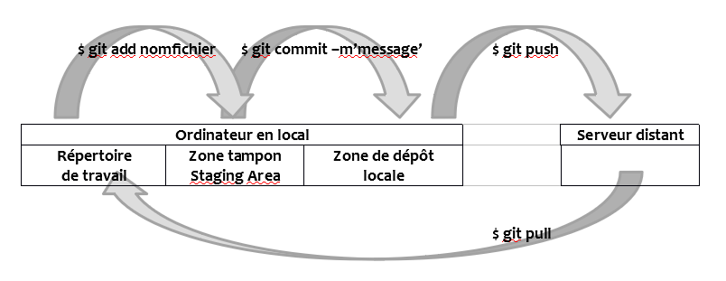

# Mémo GIT
## *Campus Numérique 2018 - Véronique*
#
## Ressources en ligne

[Documentation officielle](https://git-scm.com/doc).

[Cours OpenClassrooms](https://openclassrooms.com/courses/gerez-vos-codes-source-avec-git).

## Le fonctionnement
`Github` est une plate-forme payante pour héberger et partager des projets Git.
`Git` est un logiciel libre (créé par l’auteur du noyau Linux) pour gérer les versions de projets partagés entre plusieurs utilisateurs/créateurs distants. Il est autonome et ne dépend pas du réseau.
*A noter* : Il existe d’autres plates-formes ayant les mêmes fonctionnalités que Github tels que  `Gitlab` ou `Bitbucket` . Sur cette dernière, il est possible de créer 5 projets gratuitement. 

.

* Le `« Working Directory »` est le répertoire de travail local de git.
* La `« Staging Area »` est une zone tampon entre les fichiers modifiés et le dossier git localisé. 
* Le `« Repository »` est la zone de dépôt locale avant transfert sur la plate-forme de partage.

|         | On ne doit jamais toucher au répertoire /.git | il est l'entrepot qui contient le dossier caché de l'historique           | 
| ------------- |:-------------:|:-------------: |
## Les différentes étapes pour mettre à jour un fichier

## Les commandes principales
Après avoir installé Git en local, lancer `Git bash` pour travailler sur la console de commande.

| Commandes        | Action          | Remarques  |
| :-------------: |:-------------:| :-----:|
|| Travail en local| 
|$ pwd | Nous indique où l’on se trouve dans le répertoire |
|$ cd  +nom-fichier |Change de répertoire|va sur « nom-fichier »|
|$ git init|Initialise un projet git en local en créant un dossier /.git|À faire la première fois que l’on crée un projet en local|
|$ git status|Inspecte le contenu actuel du fichier du répertoire de travail et de la zone de transit|quand il est modifié le fichier est rouge / quand il passe dans la zone de transit il devient vert|
|$ git add +nom-fichier|Ajoute des fichiers du répertoire de travail à la zone de transit|Prépare le prochain « commit » Raccourci : Écrire les premières lettres du nom du fichier + tab|
|$ git add ‘*.txt’|Ajoute tous les fichiers .txt du répertoire de travail à la zone de transit||
|$ git diff|Permet de comparer 2 versions et voir ainsi les changements effectués |En rouge ce qui a été enlevé / En vert ce qui a été ajouté|
|$ git log|Affiche la liste de toutes  les actions effectuées dans le dépôt avec les modifications effectuées.|Pour sortir de l’affichage : « Q »|
|$ git commit –m « message »|Stocke de manière permanente les modifications de fichiers dans la zone de transit en lui attribuant un numéro unique de version en hexadécimal|Le commentaire est nécessaire et doit être explicite|
||Relations avec le serveur distant|
|$ git clone +adresse-sur-github|Crée un clone du document présent sur github|À faire pour importer un nouveau projet distant|
|$ git pull|Récupère une nouvelle version du projet sur la plate-forme de partage||
|$ git push|Envoie la nouvelle version du projet présente dans la zone de dépôt locale vers la plate-forme de partage distante|Des droits sont nécessaires pour accéder au serveur distant|

## La gestion des conflits
Quand il y a un conflit, le `« $ git status »` indique `CONFLICT`
La gestion des conflits se fait en 3 étapes : 
### Etape 1
* Repérer quels sont les fichiers en conflit : 
    
        après le fichier il y a l’indication (master merge)
* Compendre ce qui s’est passé et repérer les indications `« unmerged paths »`
        
        $ git status
        
    puis

        $ git diff **
### Etape 2
* Ouvrir le fichier dans l’éditeur
* Repérer les zones de conflit indiquées entre chevrons

        <<<<HEAD
        >>>>>>>>
* Enlever la version qui n’est pas bonne + les marqueurs de MERGE sur tout le fichier
### Etape 3
* pour avoir des indications sur ce que propose le logiciel

        $ git status
* pour préparer le MERGE

        $ git add
* pour savoir si le conflit est réglé

        $ git status
* pour mettre dans la zone de dépôt et régler le MERGE (NB le message n’est pas nécessaire car la manip ne fait que régler le MERGE et n’a aucune nouvelle modification)

        $ git commit 
* pour le transférer sur le serveur distant

        $ git push
* si nouveau conflit détecté

        $ git pull  

## Initialiser un projet en local quand le repository existe sur git

*       cd existing_folder

*       git init
*       git remote add origin URL_DU_REPOSITORY_SUR_GIT
*       git add *
*       git commit -m "Initial commit"
*       git push -u origin master