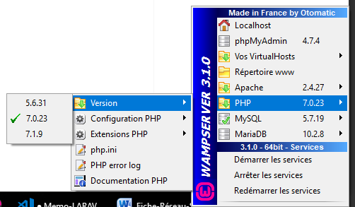

# Mémo LARAVEL - Réseau distant LINUX
## *Campus Numérique 2018 - Véronique*
#

## Cloner le projet depuis Github sur le serveur

Connexion au serveur distant

    ssh root@163......
        

cloner le projet dans le dossier personnel du serveur

    git clone projetLaravel     
    
## Installer composer sur le serveur

Dans le dossier personnel du projet laravel

    mkdir .composer  
    curl -sS https://getcomposer.org/installer | php -d allow_url_fopen=On  
    composer install
    

Créer un fichier .env (copier le fichier .env.example et le renommer en .env)

    cp .env.example .env   
    php artisan key:generate  

Modifier le chemin dans le fichier personnel.conf 

    DocumentRoot /var/www/html/nompersonnel/projetLaravel/public
    DirectoryIndex index.php
            

Relancer le serveur Apache

	service apache2 restart  

## Modifier les droits User dans le dossier Laravel

Verifier les droits du fichier storage    
    
    chown -R user/groupe dir nom fichier    

Changer les droits en écriture du fichier storage

    chmod -R a+w storage
        
    
`A noter` -R signifie récursive et concrenera le dossier et tous les fichiers enfants   

## Faire une migration de la BDD  

    créer une BDD sur le phpmyadmin du serveur
    modifier le fichier .env : username et mdp de la BDD  
    php artisan migrate:fresh   

`Autre possibilité` : Exporter le fichier .sql du phpmyadmin local et l'importer sur phpmyadmin serveur  

## Retirer la Debugbar

Faire un nano du .env  
        
    modifier : debugbar = false   
    
## Si la version de PHP n'est pas la bonne

Vérifier en local la version PHP

    php -v

Changer de version de PHP

* en local dans le serveur Wamp

    

* dans le path sous "Modifier les variables d'environnement"

        C:\wamp64\bin\php\php7.0.23

* sur le serveur

        composer update
            composer install  
