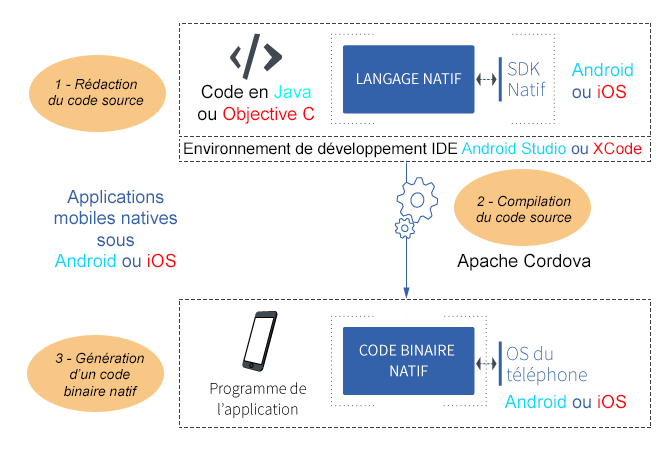
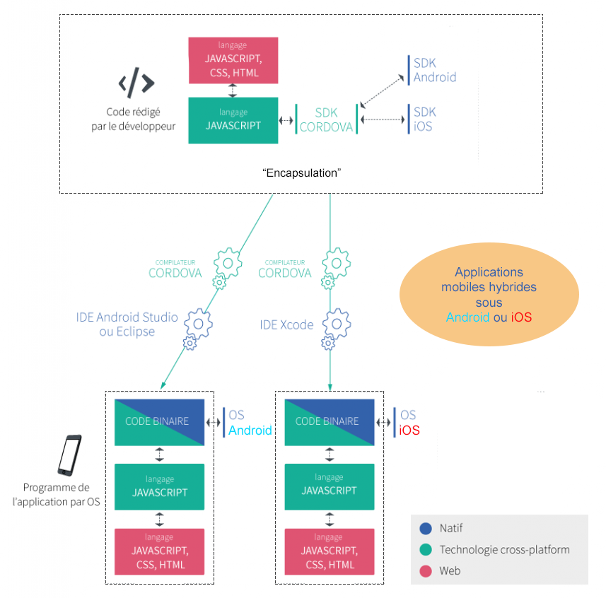
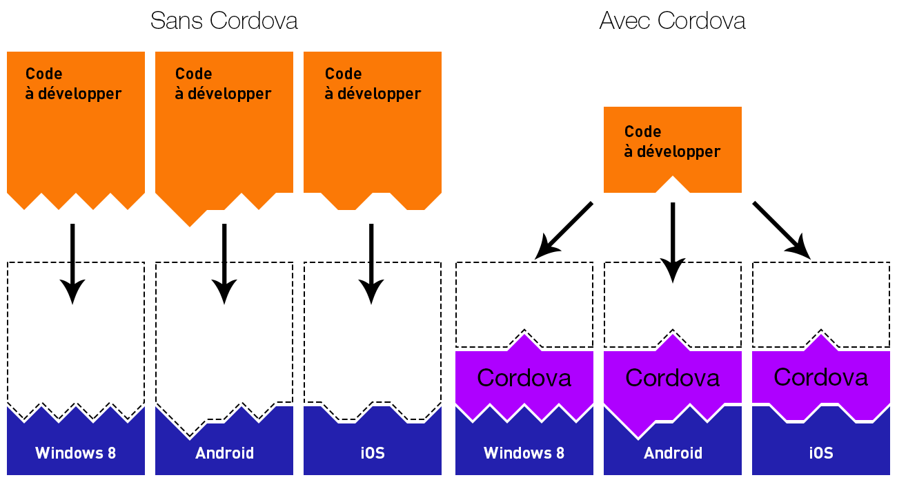
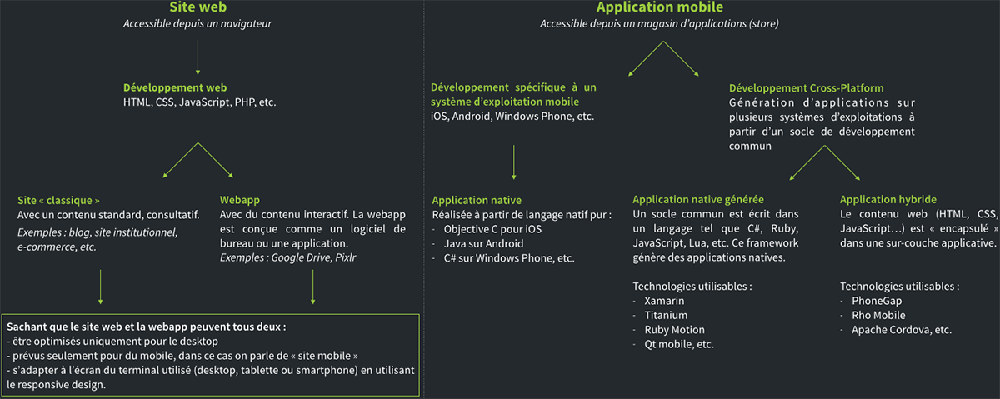
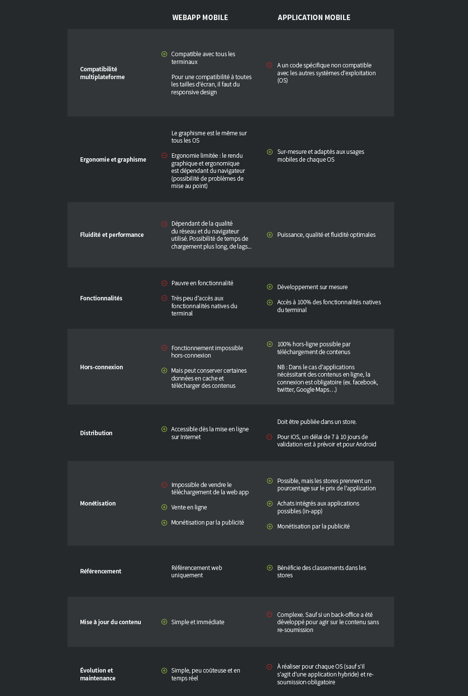

# Mémo - MOBILE
## *Campus Numérique 2018 - Véronique*
#
## Ressources en ligne

* [Mobizel](http://www.mobizel.com/2015/04/developpement-dune-application-mobile-native-13/)
* [Open Classrooms](https://openclassrooms.com/courses/des-applications-ultra-rapides-avec-node-js/les-modules-node-js-et-npm
)
* [Site officiel NPM](https://www.npmjs.com/)

## Glossaire

| Terme	| Définition |
| ------------- |:------------- |
| IDE  | Intégrated Development Environnement | 
| ||
| `Sous iOS (Apple)`	| |
| Xcode  (IDE pour iOS)	| Est un environnement de développement pour le système d'exploitation macOS ainsi que pour IOS |
| Objective-C (Langage pour iOS)	| Est un langage de programmation orienté objet réflexif extension du C. Il est principalement utilisé dans les systèmes d'exploitation d'Apple : macOS et son dérivé iOS |
| ||
| `Sous Android`	| |
| Android studio (IDE pour ANDROID)	| Est un environnement de développement pour le système d'exploitation Android |
| Eclipse (IDE pour ANDROID)	| Eclipse est un projet, décliné et organisé en un ensemble de sous-projets de développements logiciels, de la fondation Eclipse visant à développer un environnement de production de logiciels libre qui soit extensible, universel et polyvalent, en s'appuyant principalement sur Java. |
| Java (Langage pour ANDROID)	| Langage de développement pour Android |
| ||
| SDK (propre à chaque système d'exploitation)	| Pour créer une application mobile, il faut “communiquer avec le SDK natif” via le code source. SDK (Software Development Kit) est l'ensemble des outils d'accès aux fonctionalités d'un mobile (géolocalisation, contact, médias, appareil photo…) pour permettre la programmation d’applications mobiles.|
| ||
| Application mobile native générée | application mobile qui n’a pas été développée avec la technologie et le langage natifs à son système d’exploitation mais via une autre technologie (Xamarin, Titanium, Qt, etc.) qui va utiliser du code partagé entre plusieurs plateformes et générer un logiciel exécutable sur chaque OS visé.|
| Technologie cross-platform | technologie pouvant générer plusieurs logiciels à destination de systèmes d’exploitation différents à partir d’un code unique|
|||
|Compilateur|	Un compilateur est un programme qui transforme un langage de programmation source en général de haut niveau en un langage cible de plus bas niveau.|
|PhoneGap (Compilateur Cordoba pour les APP Hybrides) a des extentions commerciales|	Adobe PhoneGap ou seulement PhoneGap est un framework destiné à faciliter la création d'applications mobiles pour différentes plateformes - Android, iOS, Windows Phone. Développé par Adobe Systems, il est basé sur Apache Cordova et distribué sous licence open-source.|
|Vue.js (Framework)|Est un Framework Javascript évolutif pour construire des interfaces utilisateur. Il peut être intégré avec d'autres bibliothèques ou projets existants.|
|React (Framework)|	React (aussi appelé React.js ou ReactJS) est une bibliothèque JavaScript libre développée par Facebook depuis 2013. Le but principal de cette bibliothèque est de faciliter la création d'application web monopage. React ne génère que l'interface de l'application considérée comme la Vue dans le modèle MVC. Elle peut être utilisée avec une autre bibliothèque comme AngularJS.|
|Angular (Framework)|	AngularJS est un framework JavaScript libre et open source développé par Google. Il permet de développer des pages web.|
|Ionic (Framework)|	Framework basé initialement sur Angular JS et Apache Cordova, Ionic permet de créer un code multisupport en utilisant des outils Web comme html, CSS, Javascript, afin de générer des applications iOS, Android, Chrome, Windows Phone ou autres.|
|Task runner|	Petits logiciels écrits en JavaScript qui permettent d'automatiser les tâches récurrentes lors d'un développement Web.|
|Dépendance	|"Module indépendant ( bibliothèques) contenu dans un projet informatique (chargé dans le dossier nodes-modules) nécessaire au fonctionnement de celui-ci. L'ensemble des dépendances sont réunies dans un fichier package.json".|
|NPM (Node.js)|Package Manager à l'origine pour Node.js devenu le package manager du Javascript aussi bien en front qu'en back. C'est un gestionnaire de taches grace aux scripts qu'il permet d'exécuter.|
|||
|Single page app|	Une application web monopage (en anglais single-page application ou SPA) est une application web accessible via une page web unique. Le but est d'éviter le chargement d'une nouvelle page à chaque action demandée, et de fluidifier ainsi l'expérience utilisateur|
|App native|	Une application native est une application mobile conçue pour un système d'exploitation spécifique téléchargeable depuis les boutiques en ligne (Apple Store, Samsung Apps...)|
|App hybride|	Application basée sur un contenu Web commun aux différents systèmes d'exploitation qui est ensuite "encapsulé" dans une sur-couche adaptée aux défférents systèmes souhaités.|
|WebApp	|Une WebAPP est une application mobile basée sur les langages de programmation Html, CSS5 et JavaScript et dont accessibles sur tous les navigateurs mobiles quelque soit la plateforme. Elles sont moins coûteuses à développer que les applications natives et permettent d'avoir un responsive design sur toutes les plateformes.|
|||
|API|	Une API est une Interface de Programmation Applicative (Application Programming Interface) : Une application qui permet de récupérer une collection de données sous format .json|
|RESTFUL|	Une API compatible REST, ou « RESTful », est une interface de programmation d'application qui fait appel à des requêtes HTTP pour obtenir (GET), placer (PUT), publier (POST) et supprimer (DELETE) des données.|
|Stores	|"Boutiques en ligne permettant de télécharger des applications mobiles natives. Le Play Store pour Android et l'Apple Store pour Apple. Itunes est une application native IOs permettant de gérer des contenus multimédias."|
|||
|||

## Développement d’une application mobile native

Une `application mobile native` est une application conçue spécifiquement pour un système d'exploitation (OS) avec un langage et une technologie appropriés.

.

Tableau des langages et IDE* les plus courants pour chaque système d’exploitation

| Système d’exploitation  | Langage(s) | IDE (environnement de développement) |
| ------------- |:-------------| :-----|
| iOS (Apple)	| Objective C et Swift	| Xcode |
| Android	| Java	| Android Studio ou Eclipse |
| Windows Phone | C# (se dit “C sharp”) | Visual Studio |

## La conception en trois étapes

1 – Rédaction du code source

Le code source de la future application est rédigé dans un langage approprié à l'OS.
Pour développer une application qui puisse exploiter les fonctionnalités natives du mobile (géolocalisation, contact, médias, appareil photo…) il faut “communiquer avec le SDK natif” via le code source. C’est-à-dire programmer des « ponts » qui vont aller chercher des morceaux de codes du SDK du système d’exploitation visé. Ces derniers vont permettre d’“appeler” des fonctionnalités natives pour les intégrer dans l’application mobile.

2 – Compilation du code source

La compilation a un rôle primordial car les logiciels fonctionnent avec du code binaire qui est trop complexe pour être conçu tel quel. Il faut donc rédiger un code plus simple “human readable” (le code source) qui va passer dans un compilateur et être transformé en code binaire “machine readable”. Les IDE contiennent un compilateur.

 
3 – Génération d’un code binaire natif

Le compilateur (Apache Cordova (Open Source) /PhoneGap (commercial) ) transforme le code source en code binaire et génère un fichier spécique à chaque système d'exploitation.

| Système d’exploitation  | Nom d’extension de fichier |
| ------------- |:-------------:| 
| iOS (Apple) |	.ipa |
| Android	| .apk |
| Windows Phone	| .appx |

Pour fonctionner, ce fichier peut être téléchargé (via les magasins d’applications "stores"), installé puis exécuté sur le téléphone.

## Développement d’une application mobile native générée
Les technologies `cross-platform` permettent de réaliser un code source unique qui sera transformé en plusieurs logiciels adaptés aux OS visés.

### Fonctionnement générique d’une technologie de développement mobile cross-platform
    Conception également en trois étapes : RÉDACTION => COMPILATION => GÉNÉRATION
    
## Développement d’une application mobile hybride

Définition

* Une application mobile hybride est développée à partir de langages web (HTML5, JavaScript, CSS…)
* Elle s’appuie aussi sur des technologies natives mobiles pour utiliser certaines fonctionnalités du smartphone.
* Elle sera téléchargée depuis les magasins d’applications (stores) et installée sur le mobile.

Différente de la `web app` qui n’est consultable que depuis un navigateur. LinkedIn est une application mobile hybride.

* Programmation d'une application hybride

    
    
    
    

* Fonctionnement de Cordova pour l'encapsulation des applications hybrides

    
 
## Différences entre une WebApp et une Application Mobile

Une `WebApp` est une application avec du contenu interactif disponible en ligne qui s'adapte à la navigation sur les mobiles (responsive) ou est développé pour es mobiles (site mobile) mais qui nécessite un navigateur pour fonctionner. Elle peut être monayable via la publicité.
Elle est facile à mettre à jour car son développement est identique à un site classique (Html, Javascript, PHP...)

Une `Application mobile` est développée pour un OS spécifique (natif). Elle est disponible sur les Stores (Apple Store et Goggle App) dont elle doit obtenir une autorisation et où elle peut être payante. Elle n'a pas besoin de navigateur pour fonctionner car elle est installée sur le mobile.
Elle est plus complexe à mettre à jour car elle nécessite une modification sur chaque OS et une nouvelle autorisation de mise en ligne sur le Store.

* Récapitulatif des systèmes Site Web / Web App et Application Mobile

    

* Avantages et inconvénients des deux systèmes

    .