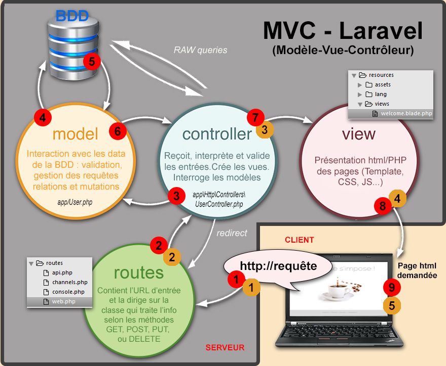
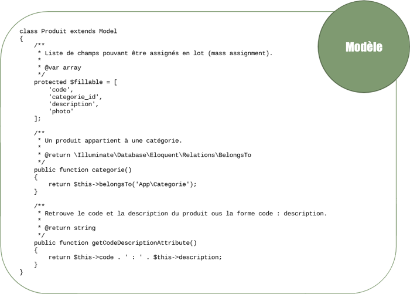
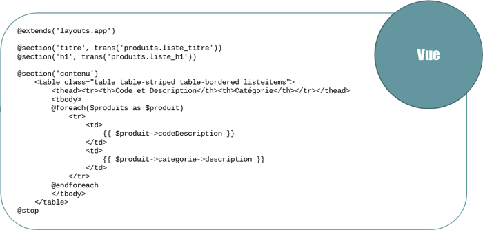
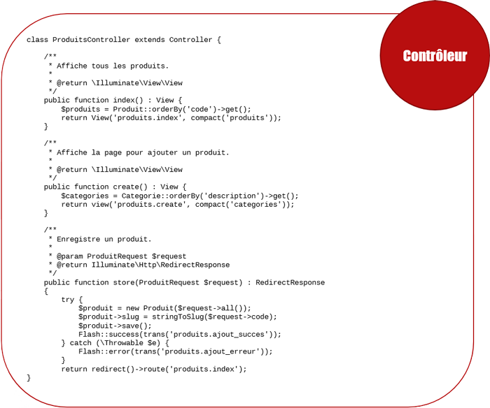

# Mémo MVC avec le FRAMWORK LARAVEL
## *Campus Numérique 2018 - Véronique ROUAULT*
#
##

[Site de Christiane Lagace](http://christianelagace.com/)

## Qu'est-ce que MVC ?
MVC est un patron de conception permettant de séparer une application Web en différentes couches : `le Modèle, la Vue et le Contrôleur`.

.

Lorsqu'on affiche une page Web Laravel dans le navigateur, l'URL ne se terminera pas par le nom d'un fichier .html ni .php. Plutôt, il s'agira d'une suite de mots ressemblant à des dossiers et sous-dossiers, comme par exemple `http://mondomaine.com/produits/creation`.

Laravel fera le lien entre cette suite de mots et une méthode d'action définie dans un `contrôleur`. Ceci sera réalisé grâce à un système de routage configuré dans Laravel.

Car avec un patron de conception MVC, tout part des `routes` définies dans le fichier `routes\web.php`.

## Les Routes

```php
<?php

/*
|--------------------------------------------------------------------------
| Web Routes
|--------------------------------------------------------------------------
|
| Here is where you can register web routes for your application. These
| routes are loaded by the RouteServiceProvider within a group which
| contains the "web" middleware group. Now create something great!
|
*/
        Route::get('/', 'IndexController@bienvenue');

```

Lorsque le client demande l'URL / (donc uniquement le nom de domaine), la vue qui s'affichera sera `bienvenue`.

D'autres routes seront ajoutées pour diriger les demandes vers la bonne méthode d'un contrôleur ou vers la bonne vue.

Par exemple, si on veut que l'URL http://Liste_boissons mène à la méthode index() du contrôleur BoissonController, on ajoutera la route suivante :
```php
Route::get('/Liste_boissons','BoissonController@index')->name('listeBoissons');
```
Il est d'usage de donner un nom composé de la première partie du nom du contrôleur, en lettres minuscules (ex : "boisson" pour BoissonController") suivi d'un point puis de la méthode d'action.

### Routes nommées

Pour de meilleures pratiques de programmation, il est bon de nommer les routes pour s'y référer dans notre code.
___
### Usage d'écriture possible :
```
Route::get('boissons', [

    'as' => 'boissons.index', // Nom donné à la route

    'uses' => 'BoissonsController@index', 

]);
```
Un contrôleur pourra passer le contrôle à la méthode d'action `index` du contrôleur `BoissonsController` en utilisant le nom de la route qui lui est associée ainsi
--> Contrôleur Laravel (PHP)
```
return redirect()->route('boissons.index');
```
Et une vue le fera ainsi --> Vue Laravel (Blade)
```
<a href="{{ route('boissons.index') }}"></a>
```
L'URL associé à la méthode d'action appelée est formé du nom de domaine suivi du premier paramètre spécifié lors de la définition de la route.
URL
```
https://lapausesimpose.club/boissons
```
___
## Le modèle (accès aux données)

Le modèle est la couche représentant les données.

Le modèle consiste en une série de classes. Si les données sont tirées de la BD, chacune des classes représentera une table.

Parmi les fonctionnalités codées dans le modèle, on retrouve les relations entre les tables. 

.

## La vue (interface utilisateur)

La vue est constituée de balises HTML qui représentent ce qui sera affiché à l'écran.

En plus des balises HTML, la vue peut utiliser des directives et instructions prévues par le moteur d'affichage afin d'effectuer différentes opérations, comme par exemple tester une condition ou encore boucler dans les données fournies par le modèle.

La vue pourra faire appel à des ressources externes, comme des feuilles de style, des fichiers JavaScript, des images, etc.

Sous Laravel, le moteur d'affichage s'appelle `Blade`.
.

## Le contrôleur (traitement)

Le contrôleur est en charge d'effectuer les traitements. Il s'agit de l'élément central du patron de conception MVC.

C'est le contrôleur qui retrouvera les données à l'aide du `modèle` et qui les passera à la `vue` pour les afficher.

Inversement, le `contrôleur` recevra les données saisies dans la `vue` et les enregistrera dans la `base de données` à l'aide du `modèle`.

En plus des échanges entre le `modèle` et la `vue`, le `contrôleur` pourra effectuer toutes sortes de tâches, comme l'envoi de courriels, l'ajout d'entrées dans le fichier de log, l'exécution d'un algorithme quelconque, etc.

.

## C.R.U.D. - CREATE READ UPDATE DELETE

L'acronyme informatique anglais CRUD (parfois appelé SCRUD avec un "S" pour search) désigne les quatre opérations de base pour la persistance des données, en particulier le stockage d'informations en base de données.

Soit :

    create : créer
    read : lire
    update : mettre à jour
    delete : supprimer

Plus généralement, il désigne les opérations permettant la gestion d'une collection d'éléments.

CRUD se réfère à la majorité des opérations implémentées dans les bases de données relationnelles. Chaque composante de l'acronyme peut être associé à un type de requête en SQL ainsi qu'à une méthode HTTP

Le routage de ressources Laravel assigne les routes "CRUD" typiques à un contrôleur avec une seule ligne de code. Par exemple, vous souhaiterez peut-être créer un contrôleur qui gère toutes les demandes HTTP pour les "boissons" proposées par votre application. En utilisant la commande `make: controller Artisan`, nous pouvons créer rapidement un tel contrôleur :
```
php artisan make:controller BoissonController --resource
```
Cette commande va générer un contrôleur sur `app/Http/Controllers/BoissonController.php`. 
qui contiendra une méthode pour chacune des opérations de ressources disponibles.

Ensuite, vous pouvez enregistrer une route vers le contrôleur :
```
Route::resource('boissons', 'BoissonController');
```
Cette déclaration d'itinéraire unique crée plusieurs itinéraires pour gérer une variété d'actions sur la ressource. Le contrôleur généré aura déjà des méthodes pour chacune de ces actions, y compris des notes vous informant des verbes HTTP et des URI qu'ils gèrent.

Vous pouvez enregistrer plusieurs contrôleurs de ressources à la fois en transmettant un tableau à la méthode resources.

### Actions traitées par le contrôleur de ressources

| Verb          | URI           | Action    | Route Name    |
| ------------- |:-------------:| ---------:| -------------:|
|GET 	        |/boissons      |	index 	| boissons.index|	
|GET 	        |/boissons/create 	|create |boissons.create|
|POST 	        |/boissons 	    |store 	    |boissons.store|
|GET 	        |/boissons/{boisson} |show 	|boissons.show|
|GET 	        |/boissons/{boisson}/edit 	|edit 	|boissons.edit|
|PUT/PATCH 	    |/boissons/{boisson} |update |boissons.update|
|DELETE 	    |/boissons/{boisson} |destroy|boissons.destroy|

### Spécification du modèle de ressource

Si vous utilisez une liaison de modèle de routage et que vous souhaitez que les méthodes du contrôleur de ressources indiquent une instance de modèle, vous pouvez utiliser l'option --model lors de la génération du contrôleur:
```
php artisan make: contrôleur PhotoController --resource --model = boisson
```