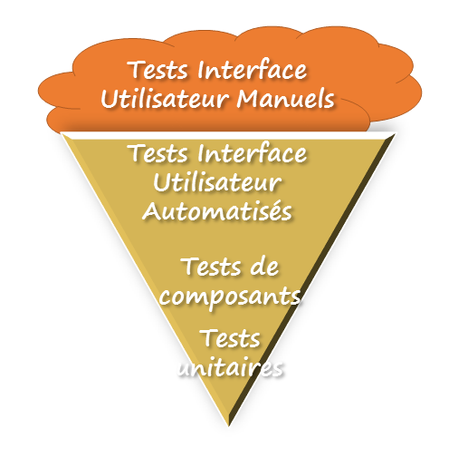
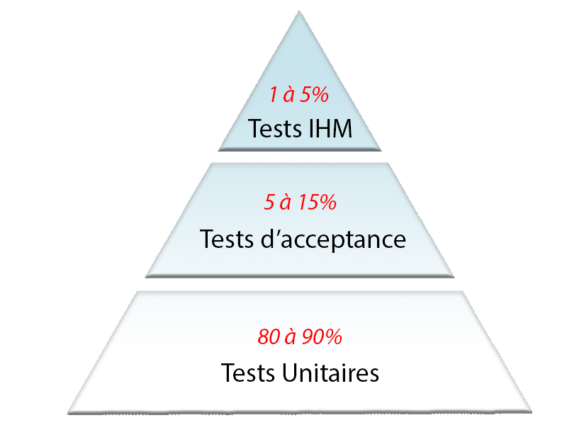

# Mémo TDD en PHP
## *Campus Numérique 2018 - Véronique*
#
## Ressources en ligne

* [Introduction au TDD](https://www.youtube.com/watch?v=FqCLf5hJuzk)
* [tests et déploiement - cdiese.fr](https://cdiese.fr/tests-et-deploiement/)
* [SoftMethods](http://softmethods.fr/la-pyramide-de-tests/)
* [img.univ-mlv.fr](http://www-igm.univ-mlv.fr/~dr/XPOSE/TesTs/SiteWeb/typestests.htm)

## Définitions

**TDD** : Test-Driven Development (Développement piloté par les tests)  
Les Tests Unitaires doivent être :
* Courts
* Explicites
* Sur un champ restreint.  

Ils sont nécessaires à la définition d'une application DONE

**Définition of DONE :**
* Test au `vert` : Ce que mon programme peut faire
* Test au `rouge` : Ce qu'il devrait faire

## Pourquoi faire des tests ?
* Vérifier que le code s’exécute
* Vérifier que le code fait ce qu’il faut
* Éviter les régressions
* Permettre les changements, le refactoring
* Développer plus vite
* Être exhaustif dans les cas testés (ex : dates)
* Diminuer les coûts (...)

## La pyramide de tests

Le concept de pyramide des tests permet de caractériser d’une manière très visuelle une stratégie de test et de la comparer à ce que devrait être une stratégie idéale. 

Dans la plupart des développements, on utilise le modèle "Cornet de glace" qui est le contraire de ce qu'il faut faire :

Un peu de test unitaire, quelques tests intermédiaires (à un niveau composant ou service) automatisés, ensuite une bonne dose de tests fonctionnels automatisés via l’interface utilisateur et, pour couronner le tout, des jeux de tests manuels eux aussi largement joués via l’interface utilisateur.

Cette pratique est due à un manque de connaissance de la pratique et un raisonnement qui consiste à penser que c'est une perte de temps de faire des tests.

Les équipes se bornent souvent à des tests sur des scénarii d'interface utilisateur.

## La pyramide idéale

Elle est constituée de 3 séries de tests principaux.

1. Les tests unitaires :

    Les tests unitaires consistent à tester individuellement les composants de l’application. On pourra ainsi valider la qualité du code et les performances d'un module.

    * Ils concernent 80 à 90% des tests 
    * Ils visent à tester des éléments précis de l’application comme des classes ou des fonctions.
    * Ils doivent être courts et s'exécuter rapidement.
    
    Ces tests sont peu couteux à exécuter car ils n’impliquent pas beaucoup de code.

    De nombreux outils existent pour faciliter l’application des tests unitaires: mockito, Moq, nUnit, JUnit etc… 

2. Tests d’acceptance : 

    * Ils concernent 5 à 15% des tests.   
    * Ils concernent une ou plusieurs fonctionnalités.
    * Ils visent à tester la réponse de l’application à une fonctionnalité dans un cadre précis. 
    
    Ces tests sont plus couteux et plus longs à exécuter que les tests unitaires car ils nécessitent l’exécution de plus de code et des interactions entres des éléments plus complexes.

    Les tests d’acceptance peuvent être décomposés en 3 groupes :

    1. Les tests d'intégration
    
        Ces tests sont exécutées pour valider l'intégration des différents modules entre eux et dans leur environnement exploitation définitif.     
        Ils permettront de mettre en évidence des problèmes d'interfaces entre différents programmes.

    2. Les tests fonctionnels

        Ces tests ont pour but de vérifier la conformité de l'application développée avec le cahier des charges initial.    
        Ils sont donc basés sur les spécifications fonctionnelles et techniques. 

    3. Les tests de non-régression
        
       Ces tests permettent de vérifier que des modifications n'ont pas altérées le fonctionnent de l'application.  
       L'utilisation d'outils de tests permet de facilité leur mise en place.

3. Tests IHM (Interface Homme Machine) :

    Les tests IHM ont pour but de vérifier que la charte graphique a été respectée tout au long du développement.
    
    * Ils représentent 1 à 5% des tests.
    * Ces tests vérifient les comportements de l’application au niveau de l’IHM ou plus généralement des entrées/sorties.

        Ils contrôlent

        * la présentation visuelle : les menus, les paramètres d'affichages, les propriétés des fenêtres, les barres d'icônes, la résolution des écrans, les effets de bord...
        * la navigation : les moyens de navigations, les raccourcis, le résultat d'un déplacement dans un écran,…

    * Ils correspondent au niveau le plus élevé où il est possible d’appliquer des tests à l’application.
    
    Ces tests sont couteux car ils sont complexes à mettre en œuvre et qu’ils nécessitent toute l’application pour s’exécuter.
    

